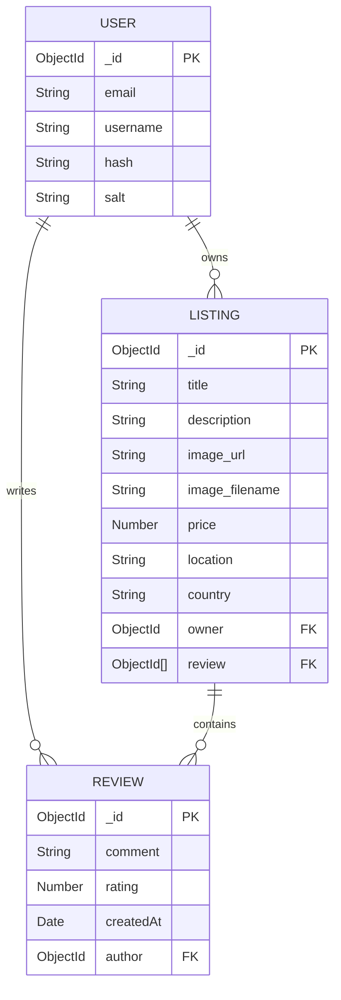

# 🌍 WanderLust

[](https://wanderlust-11jd.onrender.com/listings)
[](https://nodejs.org/)
[](https://expressjs.com/)
[](https://www.mongodb.com/atlas)
[](https://cloudinary.com/)
[](https://getbootstrap.com/)
[](https://opensource.org/licenses/ISC)

> A full-stack vacation rental marketplace web application inspired by Airbnb. WanderLust enables users to discover, list, review, and manage unique travel stays worldwide with secure user authentication, cloud-hosted images, and role-based access control.

🌐 **Live Demo:** [https://wanderlust-11jd.onrender.com/listings](https://wanderlust-11jd.onrender.com/listings)

---

## 📖 Table of Contents

- [Live Demo](#-live-demo)
- [Features](#-features)
- [Tech Stack](#-tech-stack)
- [System Architecture & MVC Pattern](#-system-architecture--mvc-pattern)
- [Project Directory Structure](#-project-directory-structure)
- [Data Models & Schema](#-data-models--schema)
- [Routes & Endpoints](#-routes--endpoints)
- [Getting Started](#-getting-started)
  - [Prerequisites](#prerequisites)
  - [Installation](#installation)
  - [Environment Variables](#environment-variables)
  - [Database Seeding](#database-seeding)
  - [Running the Application](#running-the-application)
- [Contributing](#-contributing)
- [License](#-license)
- [Author](#-author)

---

## 🌐 Live Demo

The project is deployed on Render and accessible at:  
👉 **[https://wanderlust-11jd.onrender.com/listings](https://wanderlust-11jd.onrender.com/listings)**

---

## ✨ Features

### 🏡 Property Listings (CRUD)
- **Browse Listings:** Explore accommodations with pricing, location, and high-resolution imagery.
- **Detailed View:** Dedicated property pages featuring descriptions, pricing per night, host details, and user reviews.
- **Create & Edit:** Authenticated users can create new listings and update existing ones with multi-part form uploads.
- **Delete with Cascade Clean-up:** Property owners can remove their listings, which automatically deletes all associated reviews in the database.

### 📸 Cloud Media Storage
- Real-time image uploads processed via **Multer** and securely stored on **Cloudinary**.
- Automatic image transformations and responsive media rendering.

### ⭐ Reviews & Ratings
- Integrated star-rating system powered by **Starability CSS** (1 to 5 stars).
- Users can leave feedback with comments and ratings.
- Author-restricted deletion permissions (only the review author can delete their own review).

### 🔐 Authentication & Authorization
- User registration, login, and logout powered by **Passport.js** and **Passport-Local-Mongoose**.
- Persistent user sessions stored in MongoDB with **Connect-Mongo**.
- Protected routes and authorization middleware ensuring only listing owners can modify or delete listings, and only review authors can delete reviews.
- Automatic post-login redirection back to the requested action/page.

### 🛡️ Validation & Error Handling
- Server-side schema validation using **Joi** for listings and reviews before saving to the database.
- Custom async error wrapper (`wrapAsync`) and centralized error-handling middleware (`ExpressError`).
- Flash notifications (**connect-flash**) for instant user feedback on success, warnings, or errors.

### 🎨 Modern UI/UX
- Responsive layouts built with **Bootstrap 5** and custom CSS.
- Plus Jakarta Sans typography and FontAwesome icon sets.
- Category filter navigation for quick stay discovery.

---

## 🛠️ Tech Stack

| Category | Technology |
| --- | --- |
| **Runtime Environment** | [Node.js](https://nodejs.org/) (v24.x) |
| **Backend Framework** | [Express.js](https://expressjs.com/) (v5.x) |
| **Database** | [MongoDB Atlas](https://www.mongodb.com/atlas) |
| **ODM** | [Mongoose](https://mongoosejs.com/) (v9.x) |
| **Template Engine** | [EJS](https://ejs.co/) & [EJS-Mate](https://github.com/JacksonTian/ejs-mate) (Boilerplate layouts) |
| **Authentication** | [Passport.js](http://www.passportjs.org/), [Passport-Local](https://github.com/jaredhanson/passport-local), [Passport-Local-Mongoose](https://github.com/saintedlama/passport-local-mongoose) |
| **Session & Storage** | [Express-Session](https://github.com/expressjs/session), [Connect-Mongo](https://github.com/jdesboeufs/connect-mongo), [Connect-Flash](https://github.com/jaredhanson/connect-flash) |
| **Cloud Storage** | [Cloudinary](https://cloudinary.com/), [Multer](https://github.com/expressjs/multer), [Multer-Storage-Cloudinary](https://github.com/affanshahid/multer-storage-cloudinary) |
| **Validation** | [Joi](https://joi.dev/) |
| **Frontend & Styles** | [Bootstrap 5](https://getbootstrap.com/), [FontAwesome](https://fontawesome.com/), Custom CSS, Starability CSS |

---

## 🏛️ System Architecture & MVC Pattern

WanderLust follows the **Model-View-Controller (MVC)** architectural pattern to ensure clean separation of concerns:

- **Models (`/models`)**: Defines MongoDB schemas (User, Listing, Review) and lifecycle hooks using Mongoose.
- **Views (`/views`)**: Rendered using EJS templates and layouts (`ejs-mate`) for dynamic, server-side rendered HTML.
- **Controllers (`/controller`)**: Encapsulates business logic, data operations, and interacts with models and views.
- **Routes (`/routes`)**: Modular Express routers mapping HTTP verbs and URLs to corresponding controller actions.
- **Middleware (`/middleware.js`)**: Handles authentication guards, authorization checks, and Joi payload validations.

---

## 📂 Project Directory Structure

```text
wanderLust/
├── controller/               # Route controller handlers (MVC logic)
│   ├── listings.js           # Listing business logic
│   ├── reviews.js            # Review business logic
│   └── users.js              # Authentication and user logic
├── init/                     # Database initialization & seed scripts
│   ├── data.js               # Sample listing dataset
│   └── index.js              # Seed execution script
├── models/                   # Mongoose data schemas & models
│   ├── listing.js            # Listing model with review cascade delete hook
│   ├── review.js             # Review model
│   └── user.js               # User model with passport-local plugin
├── public/                   # Static client-side assets
│   ├── css/
│   │   ├── rating.css        # Starability star rating styles
│   │   └── style.css         # Custom application styling
│   └── js/
│       └── script.js         # Client-side form validation scripts
├── routes/                   # Express route definitions
│   ├── listing.js            # /listings routes
│   ├── review.js             # /listings/:id/reviews routes
│   └── user.js               # /signup, /login, /logout routes
├── utils/                    # Utility helpers
│   ├── ExpressError.js       # Custom error class
│   └── wrapAsync.js          # Async error wrapper function
├── views/                    # EJS templates and views
│   ├── includes/             # Shared view partials (navbar, footer, flash)
│   ├── layouts/              # Master layout boilerplate (ejs-mate)
│   ├── listings/             # Listing views (index, show, new, edit)
│   ├── users/                # User authentication views (login, signup)
│   └── error.ejs             # Global error display page
├── .env                      # Environment variables (secret, not tracked)
├── .gitignore                # Git ignore configuration
├── .prettierrc.json          # Prettier formatting rules
├── app.js                    # Express application entry point & configuration
├── cloudConfig.js            # Cloudinary & Multer configuration
├── package.json              # Project dependencies and metadata
└── schema.js                 # Joi validation schemas
```

---

## 🗄️ Data Models & Schema



---

## 🛣️ Routes & Endpoints

### 🔐 User & Authentication Routes

| Method | Endpoint | Description | Access |
| --- | --- | --- | --- |
| `GET` | `/signup` | Render user signup form | Public |
| `POST` | `/signup` | Register new user account | Public |
| `GET` | `/login` | Render login form | Public |
| `POST` | `/login` | Authenticate and log in user | Public |
| `GET` | `/logout` | Terminate session and log out | Authenticated |

### 🏡 Listing Routes

| Method | Endpoint | Description | Access |
| --- | --- | --- | --- |
| `GET` | `/listings` | Display all property listings | Public |
| `GET` | `/listings/new` | Render form to create new listing | Authenticated |
| `POST` | `/listings` | Create listing with uploaded image | Authenticated |
| `GET` | `/listings/:id` | Show detailed view of a single listing | Public |
| `GET` | `/listings/:id/edit` | Render form to edit listing details | Listing Owner |
| `PUT` | `/listings/:id` | Update listing details and/or image | Listing Owner |
| `DELETE`| `/listings/:id` | Delete listing & its associated reviews | Listing Owner |

### ⭐ Review Routes

| Method | Endpoint | Description | Access |
| --- | --- | --- | --- |
| `POST` | `/listings/:id/reviews` | Submit a review with star rating | Authenticated |
| `DELETE`| `/listings/:id/reviews/:reviewId` | Delete a specific review | Review Author |

---

## 🚀 Getting Started

Follow these instructions to get a copy of the project running on your local machine.

### Prerequisites

Ensure you have the following installed on your machine:
- [Node.js](https://nodejs.org/) (Version 18.x or 24.x recommended)
- [npm](https://www.npmjs.com/)
- A [MongoDB Atlas](https://www.mongodb.com/cloud/atlas) account (or a local MongoDB server)
- A [Cloudinary](https://cloudinary.com/) account for image uploads

---

### Installation

1. **Clone the repository:**
   ```bash
   git clone https://github.com/Priyanshuoz/WanderLust.git
   cd WanderLust
   ```

2. **Install project dependencies:**
   ```bash
   npm install
   ```

---

### Environment Variables

Create a `.env` file in the root directory and add the following keys:

```env
# Cloudinary Configuration
CLOUD_NAME=your_cloudinary_cloud_name
CLOUD_API_KEY=your_cloudinary_api_key
CLOUD_API_SECRET=your_cloudinary_api_secret

# MongoDB Atlas Connection String
ATLASDB_URL=mongodb+srv://<username>:<password>@cluster0.example.mongodb.net/wanderlust?retryWrites=true&w=majority

# Environment (optional: set to production when deploying)
NODE_ENV=development
```

| Variable | Description |
| --- | --- |
| `CLOUD_NAME` | Your Cloudinary Cloud account name |
| `CLOUD_API_KEY` | Your Cloudinary API Key |
| `CLOUD_API_SECRET` | Your Cloudinary API Secret |
| `ATLASDB_URL` | MongoDB Atlas cluster connection URI |
| `NODE_ENV` | Application environment (`development` or `production`) |

---

### Database Seeding

To populate your database with initial sample listings:

```bash
node init/index.js
```

> **Note:** The seed script deletes any existing listings and creates initial properties from `init/data.js` assigned to a default user ID.

---

### Running the Application

Start the Express development server:

```bash
node app.js
```

Or run with **nodemon** for auto-reloading during development:

```bash
npx nodemon app.js
```

The application will start on port `8080`. Open your browser and navigate to:

```text
http://localhost:8080/listings
```

---

## 🤝 Contributing

Contributions, issues, and feature requests are welcome!

1. Fork the project (`https://github.com/Priyanshuoz/WanderLust/fork`)
2. Create your feature branch (`git checkout -b feature/AmazingFeature`)
3. Commit your changes (`git commit -m 'Add some AmazingFeature'`)
4. Push to the branch (`git push origin feature/AmazingFeature`)
5. Open a Pull Request

---

## 📄 License

This project is licensed under the **ISC License**.

---

## 👤 Author

**Priyanshu Ojha**
- GitHub: [@Priyanshuoz](https://github.com/Priyanshuoz)
